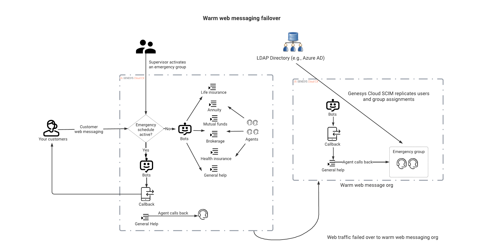

# Building business continuity in your digital channels with Genesys Cloud emergency groups and callbacks

This Genesys Cloud Developer Blueprint describes how to deploy a resilient digital channel using two different Genesys Cloud organizations and GitHub Actions.

> View the full [Build business continuity in your digital channels with Genesys Cloud emergency groups and callbacks](https://developer.mypurecloud.com/blueprints/) blueprint in the Genesys Cloud Developer Center. 
